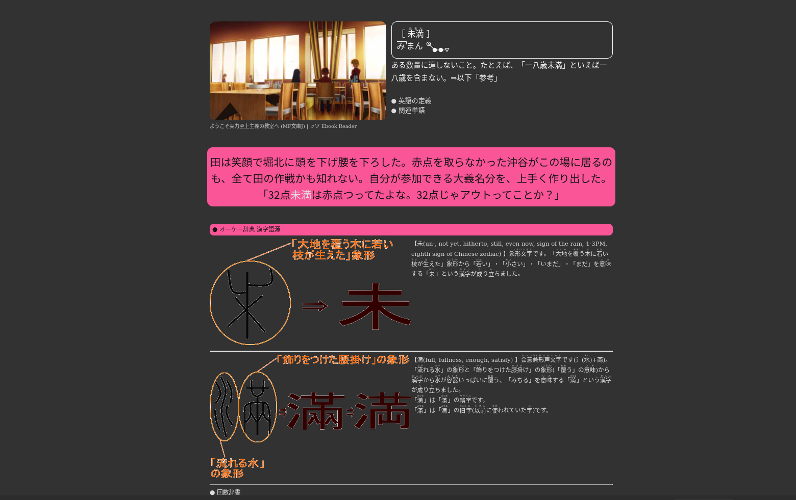

# KanjiEtymology

Anki 2.1 plugin for extracting all Kanji (i.e. the Japanese equivalent of Chinese characters) from a sentence, then querying any of the following: `tangorin.com`, `dong-chinese.com` or `okjiten.jp`. It also pulls data such as images and descriptions of the said Kanji characters and transforms them to a format that can be displayed inside Anki.

